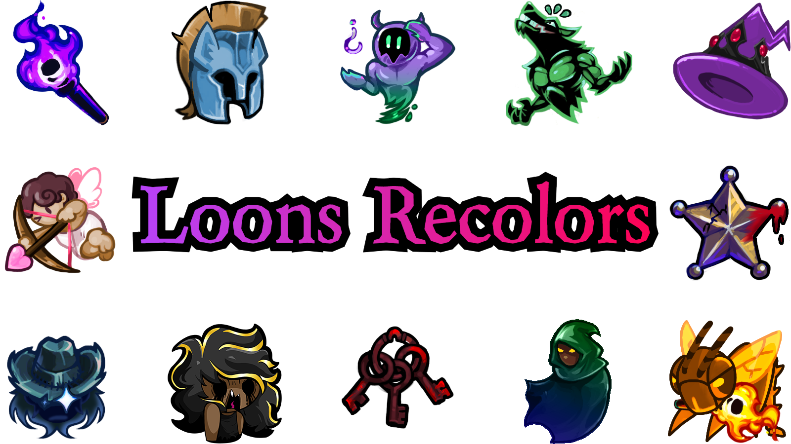

Loons Recolors is an Icon Pack for the Town of Salem 2 Icon Packs mod. 
Icons for nearly every role have been replaced, and also changes depending on your faction. (eg Town Traitors will have a different icon).

> [!WARNING]
> To use this Icon Pack, you need Town of Salem 2, the Salem Mod Loader, the Icon Packs mod, and the Witchcraft library mod. 
> All of these can be found on the [BetterTOS2 Discord server](https://discord.gg/bettertos2)! 
> Go to #suggestions and search for RiR Thread and you should find what you're looking for after a bit of searching. 
> If you cannot find the latest IconPacks.dll and/or Witchcraft.dll files, ask for help in the Discord!

## See an icon missing? / Want to update an icon?
Add it! I'm openly accepting new icons to add to the pack.
> [!IMPORTANT]
> If adding an icon for the original faction (eg Coven Leader in Coven), you must also add the icon to RegularBase in the Common folder. 

> [!NOTE]
> Pestilence and Famine have unique icons so they are not just horse icons.

